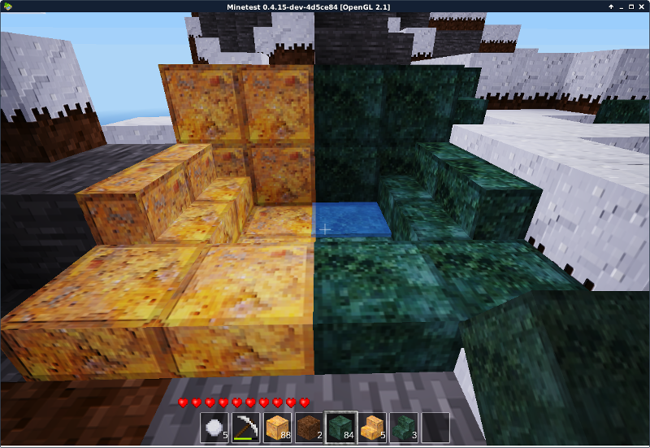

# metal_carpentry

Un premier essai de mod en vur d'introduire des métaus patinés par l'âge et des éléments de charpente métallique.

Je fais cette tentative avant tout pour apprendre. Vous pouvez faire des changements, mais je préfère cent fois des commentaires, des conseils, des explications…

Et si vous faites un changement… : expliquez-moi pourquoi ;-)
